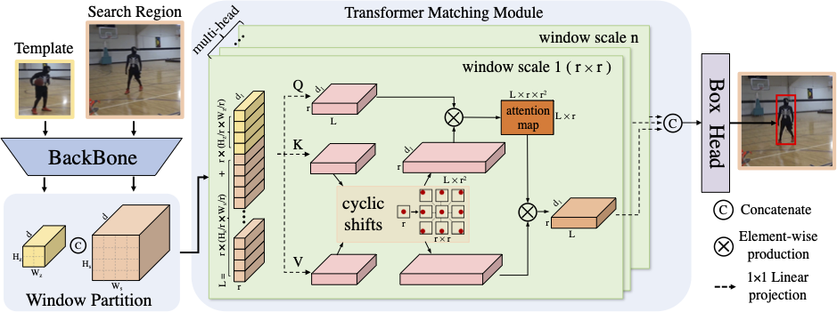

# CSWinTT

The official implementation of the CVPR 2022 paper [**Transformer Tracking with Cyclic Shifting Window Attention**](https://arxiv.org/abs/2205.03806)

[[Models and Raw results]](https://drive.google.com/drive/folders/159MAdPTJrSFbt1RLveiksk-qe_qssfPw?usp=sharing) (Google Driver) or
[[Models and Raw results]](https://pan.baidu.com/s/1vkXyPuqR7DaftcHzmUcIuQ?pwd=bsa2) (Baidu Driver: bsa2).




## Highlights
### Introduction
CSWinTT is a new transformer architecture with multi-scale cyclic shifting window attention for visual object tracking, elevating the attention from pixel to window level. 
The cross-window multi-scale attention has the advantage of aggregating attention at different scales and generates the best fine-scale match for the target object.

### Performance
| Tracker | UAV123 (AUC) | LaSOT (NP)| TrackingNet (NP)| GOT-10K (AO)| 
|---|---|---|---|---|
|**CSWinTT**|**70.5**|**75.2**|**86.7**|**69.4**|

## Install the environment
```
conda create -n cswintt python=3.7
conda activate cswintt
bash install.sh
```

## Data Preparation
Put the tracking datasets in ./data. It should look like:
   ```
   ${CSWinTT_ROOT}
    -- data
        -- lasot
            |-- airplane
            |-- basketball
            |-- bear
            ...
        -- got10k
            |-- test
            |-- train
            |-- val
        -- trackingnet
            |-- TRAIN_0
            |-- TRAIN_1
            ...
            |-- TRAIN_11
            |-- TEST
   ```
Run the following command to set paths for this project
```
python tracking/create_default_local_file.py --workspace_dir . --data_dir ./data --save_dir .
```
After running this command, you can also modify paths by editing these two files
```
lib/train/admin/local.py  # paths about training
lib/test/evaluation/local.py  # paths about testing
```

## Train CSWinTT
```
python tracking/train.py --script cswintt --config baseline_cs --save_dir . --mode single 
python tracking/train.py --script cswintt_cls --config baseline_cs --save_dir . --mode single --script_prv cswintt --config_prv baseline_cs  
```
## Test CSWinTT
Download the model and put it in output/checkpoints

- UAV123
```
python tracking/test.py cswintt baseline_cs --dataset uav --threads 32
```
- LaSOT
```
python tracking/test.py cswintt baseline_cs --dataset lasot --threads 32
```
- GOT10K-test
```
python tracking/test.py cswintt baseline_got10k_only --dataset got10k_test --threads 32
```
- TrackingNet
```
python tracking/test.py cswintt baseline_cs --dataset trackingnet --threads 32
```

## Model Zoo and raw results
The trained models and the raw tracking results are provided in the [[Models and Raw results]](https://drive.google.com/drive/folders/159MAdPTJrSFbt1RLveiksk-qe_qssfPw?usp=sharing) (Google Driver) or
[[Models and Raw results]](https://pan.baidu.com/s/1vkXyPuqR7DaftcHzmUcIuQ?pwd=bsa2) (Baidu Driver: bsa2).

## Contact
Zikai Song: skyesong@hust.edu.cn 

## Acknowledgments
* Thanks for the [PyTracking](https://github.com/visionml/pytracking) Library and [STARK](https://github.com/researchmm/Stark) Library, which helps us to quickly implement our ideas.